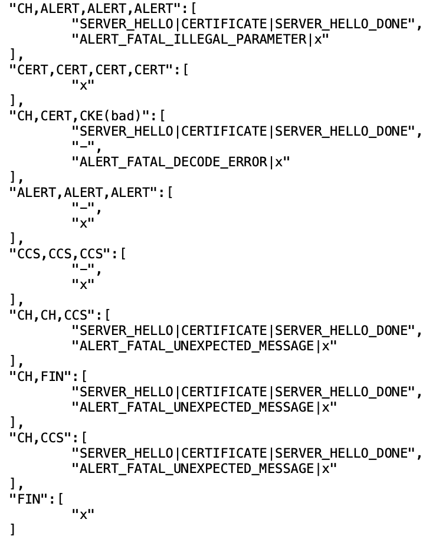
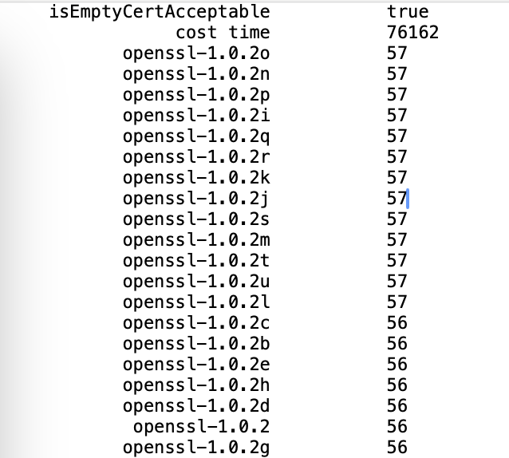
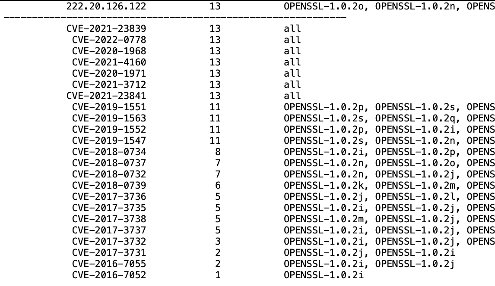

# TSI-Prober

TSI-Prober is a Java-based framework that can identify the type and version of TLS server implementations. For example, it can determine whether a website's server is using the OpenSSL-1.1.1x library. Additionally, by integrating publicly available CVE (Common Vulnerabilities and Exposures) information, TSI-Prober assists pentesters in analyzing the security risks of TLS services.

## Requirement

* Java 11+
* Maven 3.6.3 or later

## Building

```shell
mvn clean package
```

## Usage

To perform identification on a specific TLS server, the following command can be used:

```shell
java -jar ./target/TSI-Prober-1.0-SNAPSHOT.jar --address <ip> --port <port>
```

For example,

```shell
java -jar ./target/TSI-Prober-1.0-SNAPSHOT.jar --address example.com --port 443
```

To conduct batch identification on multiple TLS servers, the following command can be utilized:

```shell
java -jar ./target/TSI-Prober-1.0-SNAPSHOT.jar --domainFile domains.csv
```

The *domains.csv* file contains a single column, with each row listing a domain. For example,

```text
example1.com
example2.com
example3.com
```

Help information can also be viewed to provide custom inputs.

```shell
java -jar ./target/TSI-Prober-1.0-SNAPSHOT.jar --help
usage: TSI-Prober --address=[IP] --port=[PORT] ...
    --address <ip>                  (required) the IP address of the
                                    target to be identified
    --config <file>                 use a customized configuration file
    --cve                           scan potential known vulnerabilities
    --domainFile <file>             if you want to identify domains in
                                    batch, write domains in a csv file
 -h,--help                          print the help message
    --interval <time>               set the time interval between probes
    --out <filename>                specify the name of the output file
    --port <port>                   (required) the port of the target to
                                    be identified
    --probe <file>                  use a customized probe file
    --responseMatchDB <directory>   use a customized TLS behaviors
                                    database

```

By enabling the **--cve** option, users can quickly scan for potential CVE vulnerabilities in the website under test.

**Note:** *To activate the vulnerability scanning feature, it is necessary to first build a Neo4j database using the Excel files in the TLS CVE Dataset. Then, set the URL, Username, and Password for the Neo4j database in config.properties. Finally, execute the following command:*

```shell
java -jar ./target/TSI-Prober-1.0-SNAPSHOT.jar --address example.com --port 443 --config config.properties --cve
```

## Output

By default, TSI-Prober outputs two files in the output folder:

1. example.json
2. examlpe.txt

The *example.json* file contains the response messages of *example.com* to all probes; The *example.txt* file includes the top one hundred TLS versions most similar to the TLS behavior used by *example.com*. 

If the **--cve** option is enabled and there is a TLS similarity to *example.com* greater than a specific threshold (default is 50), an additional file, *example.security.txt*, will be generated. This file indicates the potential CVEs present in *example.com*.

### example.json


### example.txt


### example.security.txt



